<div align="center">

[Deutsch](README.de.md) · **English**

# 📘 DokuVault

### Open-source IT documentation for managed service providers

Central, multi-tenant documentation of a customer's **entire IT** — from sites through servers,
network and Active Directory to licences and credentials. With a guided initial survey,
PDF export, global search across every customer, and devices that
**document themselves** through an agent.

[](https://github.com/PhilippKuhlmann/dokuvault/actions/workflows/tests.yml)


**[▶ Try the live demo](https://doku.dokuvault.de)**

Sign in as `admin`, `techniker`, `kunde-rw` or `kunde-r` — the password is `password` for all four
<br><sub>Each role sees something different. Change anything you like; the demo resets every hour.</sub>

<br>

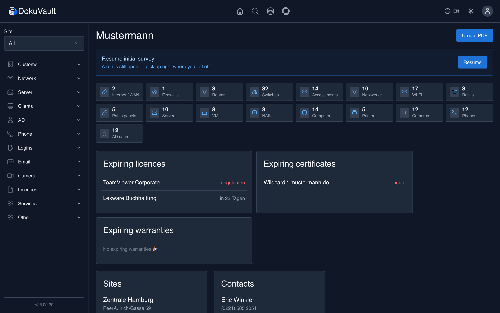

</div>

---

## ✨ Why DokuVault?

MSPs lose time to scattered spreadsheets, stale wikis and “where did we write that down?”.
**DokuVault** keeps it all in one place — structured, searchable, encrypted and current.

|  |  |
| --- | --- |
| 🏢 **Multi-tenant** | Every customer with their own sites, devices and credentials, cleanly separated |
| 🧭 **Initial survey wizard** | 16 steps through a new customer — ask, save the answer, next |
| 🔌 **Patch panels** | Outlet number, room and target switch per port — “where does outlet A.12 go?” |
| 🔎 **Global search** | Find a server, IP, serial number or MAC across **all** customers in seconds |
| 🤖 **Auto-documentation** | One script on the device — the rest documents itself (Proxmox, Windows AD) |
| 🌐 **IPAM** | Used and free IP addresses per VLAN at a glance, DHCP and gateway detection |
| 🔐 **Encrypted** | Every password stored encrypted, role-based access, audit log |
| 📄 **PDF export** | Complete customer documentation as a PDF at the push of a button |
| 🌙 **Light & dark** | Modern, responsive UI — on the phone too |
| 🌍 **German & English** | Switchable per user, or following the browser |
| ⏰ **Expiry warnings** | Licences, certificates and domains never expire unnoticed |
| ♻️ **Recycle bin** | Deleted by accident? Restore instead of re-entering |

---

## 📸 Screenshots

<table>
  <tr>
    <td width="50%"><br><sub><b>Customer dashboard</b> – inventory, expiring licences & certificates at a glance</sub></td>
    <td width="50%">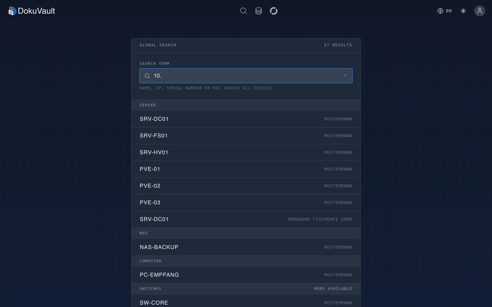<br><sub><b>Global search</b> – across every device type and customer</sub></td>
  </tr>
  <tr>
    <td width="50%">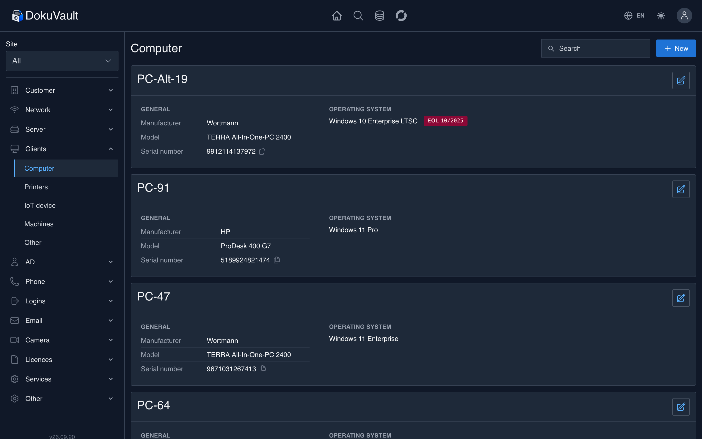<br><sub><b>Devices</b> – tidy cards, copy IP or serial number with one click</sub></td>
    <td width="50%">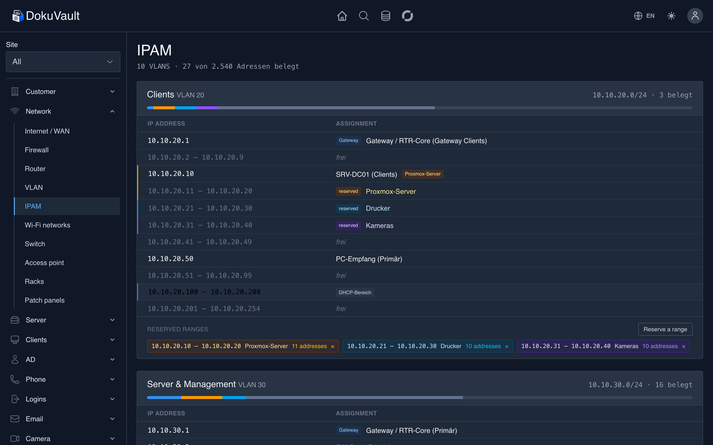<br><sub><b>IPAM</b> – used and free addresses per VLAN</sub></td>
  </tr>
  <tr>
    <td width="50%">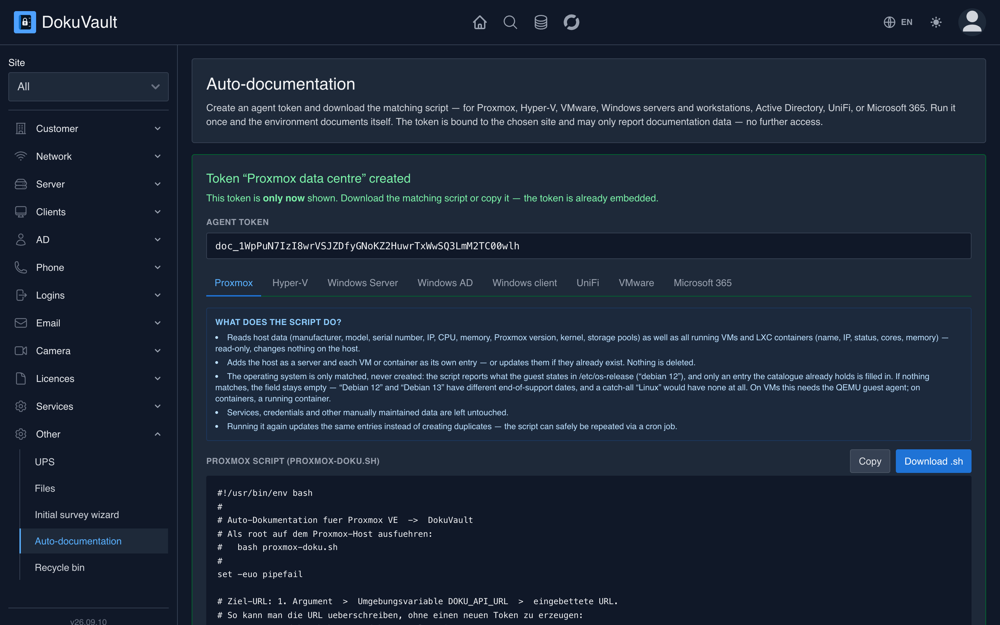<br><sub><b>Auto-documentation</b> – create an agent token, run the script, done</sub></td>
    <td width="50%">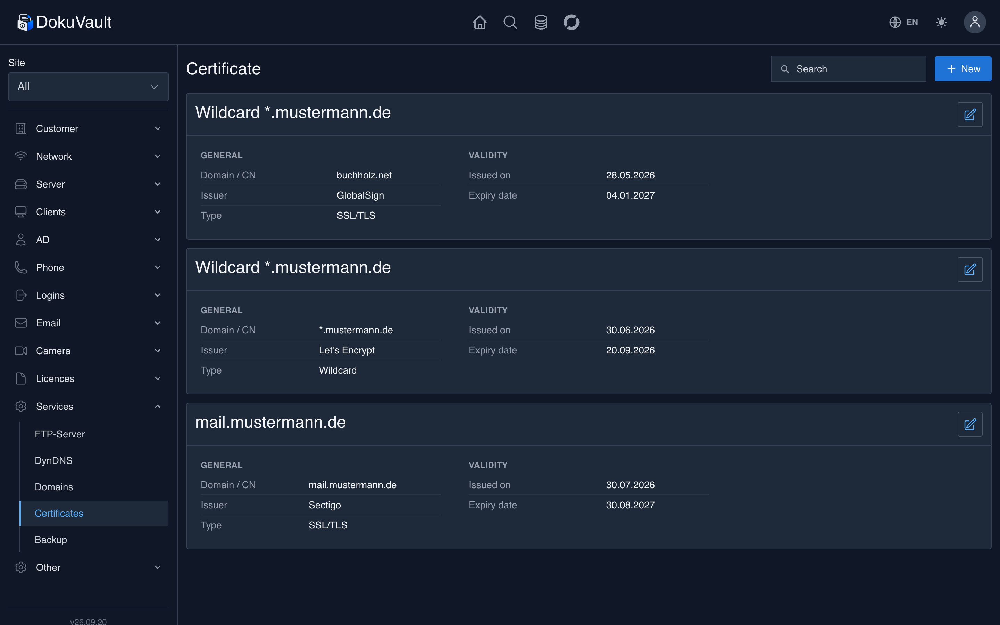<br><sub><b>SSL/TLS certificates</b> – with an expiry warning on the dashboard</sub></td>
  </tr>
  <tr>
    <td width="50%">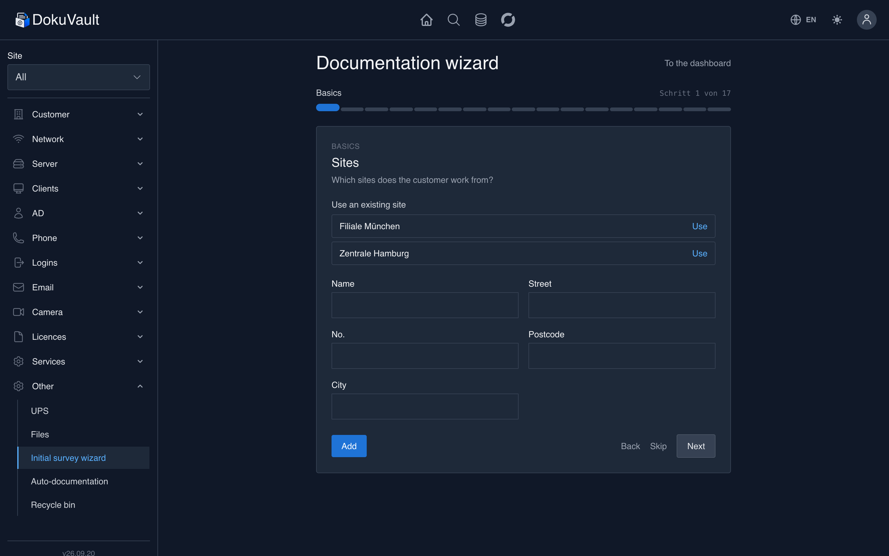<br><sub><b>Initial survey wizard</b> – one question per step, existing entries stay visible</sub></td>
    <td width="50%">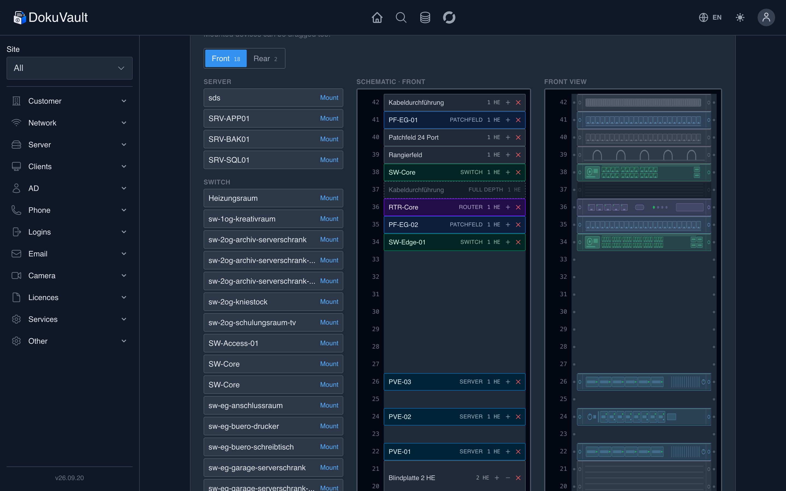<br><sub><b>Racks</b> – mount the front and the rear, with the drawn view beside it</sub></td>
  </tr>
  <tr>
    <td width="50%">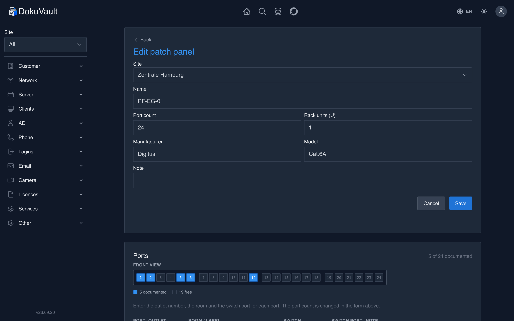<br><sub><b>Patch panel ports</b> – outlet number, room and target switch per port</sub></td>
    <td width="50%">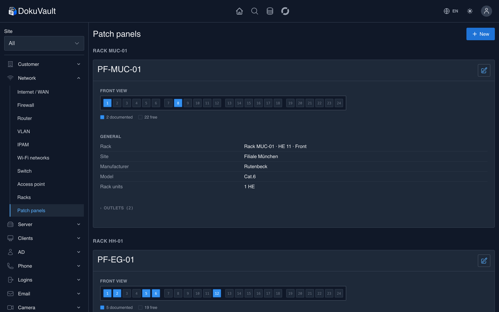<br><sub><b>Outlet overview</b> – which outlet sits on which switch port</sub></td>
  </tr>
  <tr>
    <td width="50%">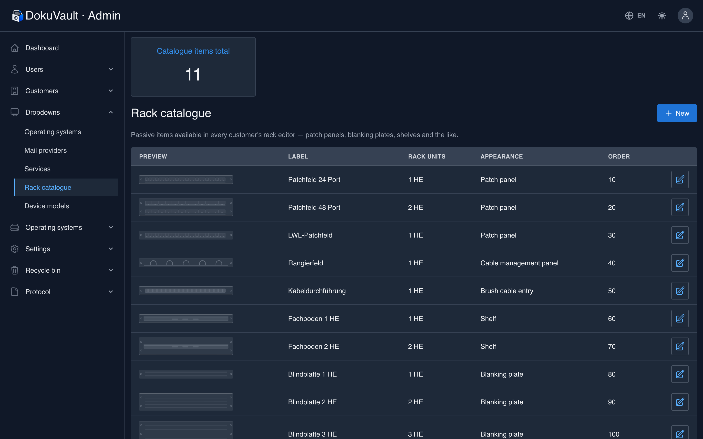<br><sub><b>Rack catalogue</b> – maintain blanking plates, shelves & co. in the admin area</sub></td>
    <td width="50%">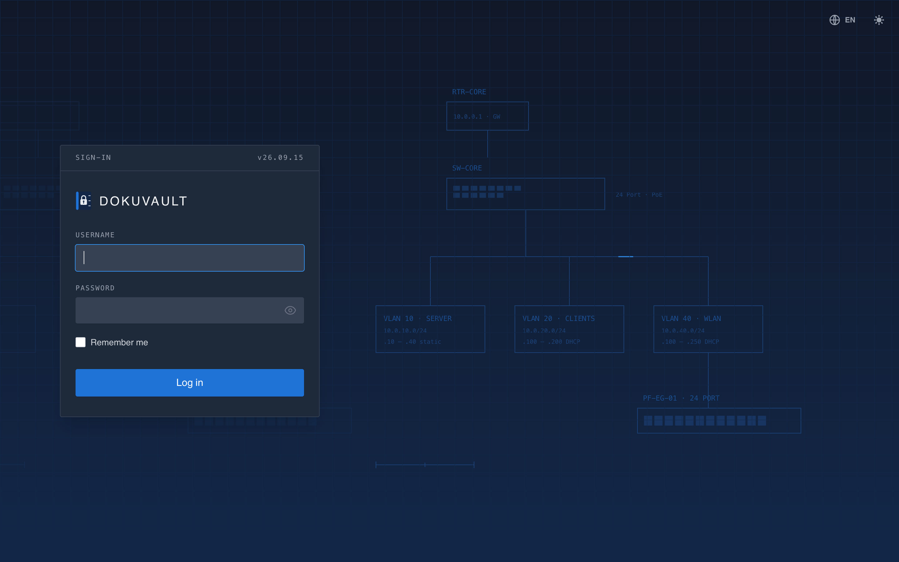<br><sub><b>Sign-in</b> – light/dark and language switchable, even before signing in</sub></td>
  </tr>
  <tr>
    <td width="50%">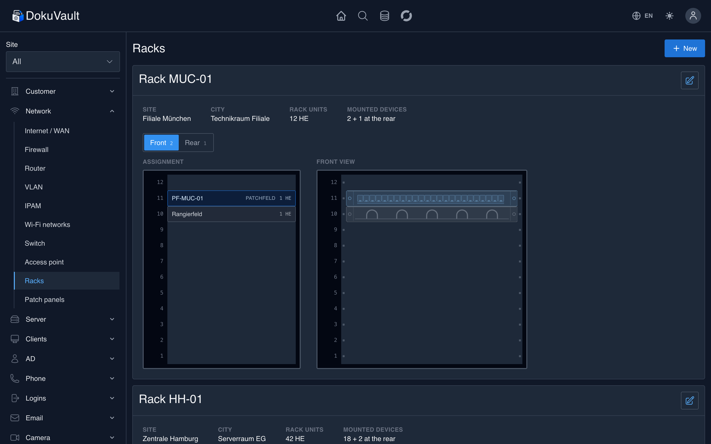<br><sub><b>Rack overview</b> – key facts in one row, occupancy and drawing per side</sub></td>
    <td width="50%"></td>
  </tr>
</table>

---

## 🧭 Initial survey wizard — guided, not guessed

Taking on a new customer used to mean: find the area in the sidebar, click “New”, fill in the form,
save, go back, next area — sixteen times over. You had to know **what** to document and **in which
order**.

The wizard turns that around. It asks one question at a time (“Which VLANs are there?”) and creates
each answer straight away:

| Phase | Steps |
| --- | --- |
| **Basics** | Sites → contacts |
| **Network** | Internet connections → routers → VLANs → Wi-Fi networks → switches → access points |
| **Servers & storage** | Servers → VMs → NAS |
| **Clients** | Computers → printers |
| **Services** | AD domains → phone systems → backups |

- **The order lives in the app**, not in your head: Wi-Fi comes after the VLANs, and its dropdown
  already contains the networks you just created.
- **Saved immediately** — every entry lands in the documentation right away, not at the end.
- **Existing entries stay visible** above the form, and steps can be skipped.
- **Resumable at any time** — progress is stored in the database, and the dashboard offers an open
  run to continue.
- **The same rules as the ordinary forms**: validation comes from the same FormRequests, and steps
  you have no create permission for are never shown.

Start under **Other → Initial survey wizard**, or from the card on the customer dashboard.

---

## 🤖 Auto-documentation — devices document themselves

No more typing things over. Create an **agent token bound to a customer and site** in the interface,
download the matching script and run it on the device — the infrastructure lands in the
documentation by itself. Repeated runs update instead of duplicating.

```bash
# On the Proxmox host, as root:
bash proxmox-doku.sh
```

The Proxmox agent records host hardware, serial number, IP and **all VMs & LXC containers**
(including the IP via the QEMU guest agent) and creates them as a server with its guests.

```powershell
# On a domain controller (or a machine with the RSAT AD module):
.\windows-ad-doku.ps1
```

The Windows AD agent reads all users plus **only self-created groups** — default and built-in groups
and system accounts (Guest, krbtgt, DefaultAccount …) are filtered out on the domain controller
itself, while the built-in Administrator is kept. Passwords are never read or transmitted.

Every token may **only document** — a leaked one grants no further access. More agents will follow.

---

## 🧩 Features

- **Customers & sites** — a multi-tenant structure per customer
- **Infrastructure** — servers, VMs (with host assignment), NAS, computers, UPS, machines, IoT
- **Racks** — drag-and-drop mounting, **front and rear**: place documented devices and passive items
  per rack unit. Full-depth devices occupy both sides, half-depth ones leave room behind them. Next
  to the labelled schematic there is a drawn view that follows the height; the catalogue of passive
  items is maintained in the admin area
- **Patch panels** — outlet number, room and target switch with port number per port; the port rows
  are created automatically from the port count
- **Network** — routers, switches, access points, Wi-Fi, VLANs, **IPAM**, internet/WAN, UTM firewalls; internet connections optionally with a routed subnet (CIDR) and gateway
- **Active Directory** — domains, users, groups
- **Communication** — phone systems, DECT, mailboxes, email archiving
- **Security & certificates** — SSL/TLS certificates with expiry warnings
- **Devices** — cameras, recorders, printers
- **Services** — FTP, DynDNS, domains, backups
- **Licences** — software, Windows and access licences including expiry dates & file upload
- **Credentials** — encrypted logins, show and copy passwords, previous password stays available
  for a configurable retention period — for when someone changed it by mistake
- **Data capture** — initial survey wizard (16 guided steps), auto-documentation via agent, agent
  tokens managed on their own page (create, one-time reveal, revoke)
- **Operations** — global search, searchable & filterable activity log (event, object type, user,
  time range), recycle bin (restore, plus an admin-wide view across every customer), PDF export,
  file storage
- **Invite users** — by email rather than by reading a password out to them: the invitee sets
  their own via a link
- **Admin area** — permission-based, not role-hardcoded: customers, users & roles, dropdowns,
  settings, recycle bin, activity log and API tokens are separate permissions, freely combinable
  per role
- **Settings** — without server access: name and logos, language, time zone, a note on the sign-in
  page, rows per page, upload limit and permitted file extensions; SMTP credentials for outgoing
  mail; advance warning for licences, certificates, warranties and end of support, plus how long
  PDF exports are kept; password rules, login lockout and session length
- **Site filter** — narrows device lists, IPAM and auto-documentation to a single site
- **Language** — German and English, per user or following the browser

---

## 🔒 Security

- **Two-factor sign-in (TOTP)** — set up in the profile, by QR code or a copyable secret, with
  recovery codes to print. An administrator can require it for individual users; until they set it
  up, those users get no further than their own profile
- **Brake against guessing** — two counters: one per account, one per origin. Trying a single
  password against many usernames never trips the first one. Attempts and lockout period are
  configurable
- **Configurable password rules** — minimum length, mixed case, digit, symbol and a check against
  known breaches. This governs the passwords users **sign in** with — not the customer passwords
  you document: there you record what is, not what ought to be
- **Sessions bound to the password hash** — changing a password ends every other session that user
  has, including the one on a lost laptop
- Passwords and sensitive fields **encrypted at rest** (`Crypt`)
- **Role-based** access (admin / technician / customer) with granular permissions
- **Audit log** of every change; a changed password never appears in the log itself — the previous
  value lives encrypted in its own table, revealed only on click and only to those who can already
  see the device
- Protection against **IDOR** (foreign customer/site assignment), XSS hardening, encrypted sessions
- **File uploads** hardened against path traversal in the filename; what is allowed is an allow
  list of extensions that can be shortened but not extended
- **PDF exports** hold every one of a customer's credentials in the clear and are deleted
  automatically after a configurable period
- Responsible disclosure via [SECURITY.md](SECURITY.md)

---

## 🏗️ Architecture

Every object type follows the same pattern — know one, know them all. Four lists in
`config/custom.php` hold it together:

| Key | What for |
| --- | --- |
| `permissions` | creates the gates `_viewAny`, `_create`, `_update`, `_delete` per object (in `AuthServiceProvider`) |
| `trashables` | which objects appear in the recycle bin and can be restored |
| `list_titles` | heading of the respective list page |
| `wizard_steps` | order, questions and fields of the initial survey wizard |

A new object type therefore needs a model, migration, FormRequest, controller and views — plus one
entry in each list that concerns it. Permission gates, recycle-bin support and page titles follow
from that on their own.

Every resource lives under `/{customer}/…`; the customer binding is enforced through route model
binding and `getFilteredQuery()` in the base controller, which also applies the site filter from the
sidebar. Password fields are encrypted by the model itself through an `Attribute` cast, so plain
text reaches neither the database nor the audit log.

---

## ⚙️ Tech stack

| Area | Used |
| --- | --- |
| **Backend** | PHP 8.2 · Laravel 12 · Livewire 4 · Laravel Sanctum 4 *(agent/API tokens)* |
| **Packages** | spatie/laravel-activitylog 4.12 *(audit log)* · barryvdh/laravel-dompdf 3.0 *(PDF export)* · spatie/laravel-backup 9.3 |
| **Frontend** | Tailwind CSS 3.4 · Alpine.js 3 · Flowbite 1.8 · Vite 3 |
| **Database** | MySQL / MariaDB |
| **Quality** | Pest 3 *(1033 tests)* · Laravel Pint · GitHub Actions CI |

---

## 📦 Installation

Requirements: either Docker — or PHP 8.2+, Composer, Node.js and MySQL/MariaDB.

### With Docker (quickest)

```bash
git clone https://github.com/PhilippKuhlmann/dokuvault.git && cd dokuvault && docker compose up
```

Then open [http://localhost:8000](http://localhost:8000) and sign in with `admin` / `password`.
The first start creates the database, demo data and accounts by itself; a second start does not
seed again, so anything you entered stays.

The container is meant for trying things out and for small installations: one process with
Laravel's built-in server, no nginx. For many users, the route in
[DEPLOYMENT.md](DEPLOYMENT.md) is the right one.

### To try it out (with demo data)

Installs the demo customer “Mustermann” with realistic sample data. The demo data needs
`fakerphp/faker`, so install **with** dev dependencies here.

```bash
git clone https://github.com/PhilippKuhlmann/dokuvault.git
cd dokuvault

composer install                     # incl. dev packages (Faker for the demo data)
npm install && npm run build

cp .env.example .env                 # adjust APP_ENV=local, database credentials etc.
php artisan key:generate

php artisan migrate:fresh --seed     # creates the demo customer + demo accounts
```

Then sign in with one of the demo accounts.

### Production (without demo data)

For a real server — **no** Faker, no demo data, only the seed data (admin user, roles/permissions,
operating-system and mail-provider lists):

```bash
composer install --no-dev --optimize-autoloader
npm install && npm run build

cp .env.example .env
# IMPORTANT in .env:  APP_ENV=production   (drives the HTTPS requirement and the seeder)
php artisan key:generate

php artisan migrate --force
php artisan db:seed --force          # runs the ProductionDatabaseSeeder
```

> The seeder branches on `APP_ENV`: demo data for `local`, only the seed data for `production`.
> With `APP_ENV=local` but installed without dev packages, seeding fails (`fake()` not found) —
> then either set `APP_ENV=production` or install with dev packages.

### Updating

Bringing an existing installation up to date — backup, `git pull`, dependencies, migrations — is
described step by step in **[DEPLOYMENT.md → Updating](DEPLOYMENT.md#updating)**. To pin a
version instead of following `main`, use a tag in the format `vYY.MM.DD`.

### Deploying automatically

A push to `main` can update the server by itself: the tests run first, and only if they pass does a
GitHub Action fetch the new state over SSH, migrate and rebuild the caches. Setup, secrets and the
hourly reset of a public demo are described in **[DEPLOYMENT.md](DEPLOYMENT.md)**.

---

## 👥 Roles & demo accounts

| Role             | Permissions                                    |
| ---------------- | ---------------------------------------------- |
| **Admin**        | Everything, always — a built-in override that can't be locked out by an unchecked box |
| **Technician**   | Access to all customers; the admin area is available role by role — see below |
| **Customer**     | Sees only their own data                        |

The seeder creates four accounts — the same ones apply in the
**[live demo](https://doku.dokuvault.de)**. You see the most by trying them one after another: the
sidebar, the “New” buttons and the admin area change with the role.

| Username     | Password   | Role       | What it shows |
| ------------ | ---------- | ---------- | ------------- |
| `admin`      | `password` | Admin      | Everything: all customers, the full admin area, activity log |
| `techniker`  | `password` | Technician | All customers, plus the full admin area in the demo — see below |
| `kunde-rw`   | `password` | Customer   | Only the customer “Mustermann”, read **and** write |
| `kunde-r`    | `password` | Customer   | Only the customer “Mustermann”, read-only — no “New” or “Edit” buttons |

The admin area is **permission-based, not role-hardcoded**: each of its sections — customers,
users & roles, dropdowns, settings, recycle bin, activity log, API tokens — has its own permission,
freely combinable per role in the role editor. A second technician group that may see the recycle
bin and the activity log but not manage users is a checkbox away, not a code change. Only the
built-in **Admin** role is special: it passes every permission check unconditionally, so removing
“manage roles” from it by accident can never lock out the last administrator. In the demo, both
`admin` and `techniker` have every permission checked, which is why they look identical there.

> ⚠️ **These accounts do not belong on a real server.** They come from the demo seeder and all share
> the same password. For production, create your own users and delete the demo accounts.

---

## 🧪 Tests

1033 feature tests (Pest 3) run against an in-memory SQLite — no setup needed, no traces in your
development database. GitHub Actions runs the same suite on every push, against PHP 8.2 and 8.3 with
SQLite and MariaDB, plus PHP 8.4 alongside but not blocking.

```bash
php artisan test
```

Individual areas:

```bash
php artisan test --filter=DocumentationWizard
```

Covered are, among others, tenant separation (no access to other customers or sites), the permission
gates per role, the initial survey wizard including the field lists of its steps, the site filter
across all lists, and the recycle bin with restoring. Plus two-factor sign-in, the brake against
guessing, and encryption at rest: one test compares every column whose name suggests a secret
against those actually encrypted — add a new one and you must either encrypt it or record why not.

Check the code style before committing:

```bash
./vendor/bin/pint
```

---

## 🤝 Contributing & licence

Contributions are welcome — see [CONTRIBUTING.md](CONTRIBUTING.md) and
[CODE_OF_CONDUCT.md](CODE_OF_CONDUCT.md). Please report security issues as described in
[SECURITY.md](SECURITY.md), not as a public issue.

Released under the [MIT licence](LICENSE).
